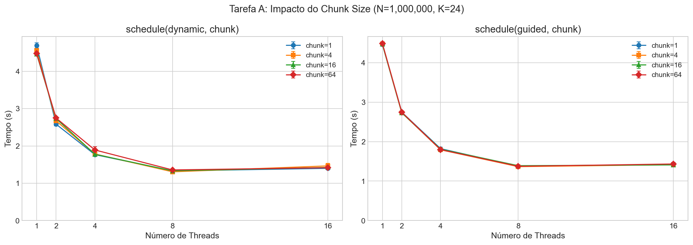
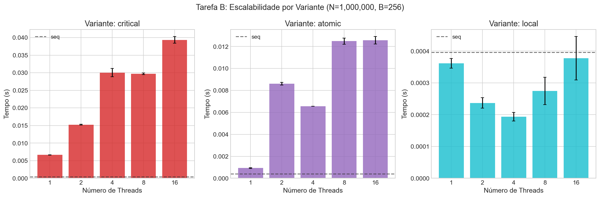
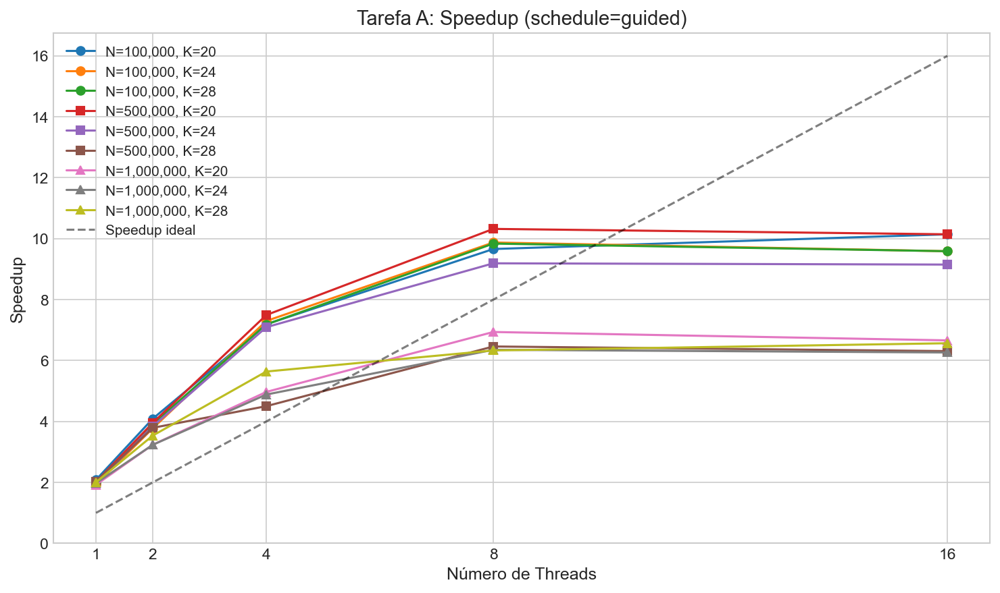
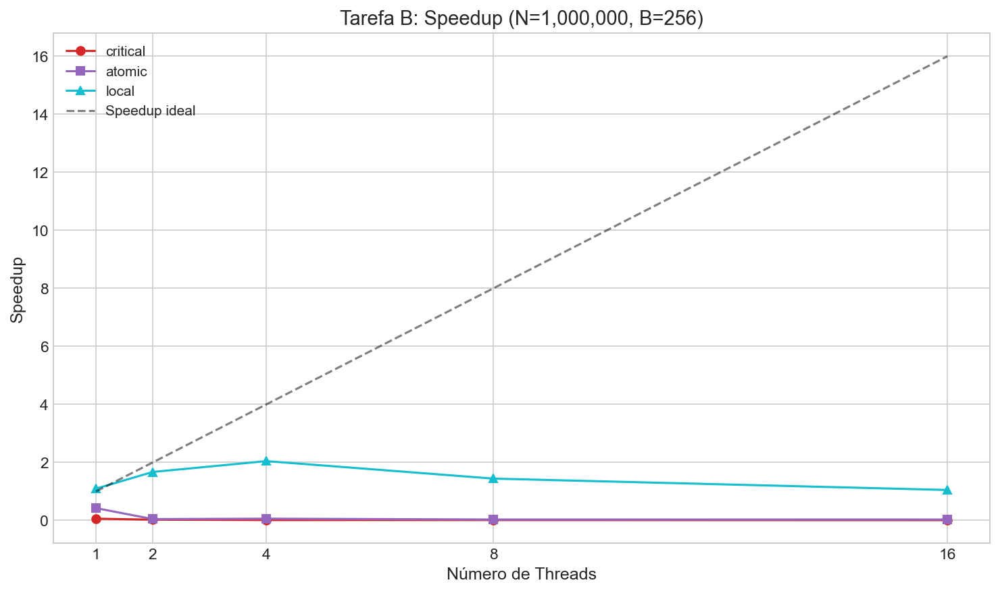

# Resultados

## Tarefa A — Laço Irregular e Schedule

### Resultados

#### Impacto do Chunk Size



**Observações:**

- Chunk muito pequeno (1): alto overhead de sincronização
- Chunk muito grande (64): perde balanceamento
- Chunk intermediário (16): melhor compromisso

### Conclusões da Tarefa A

1. **`static` tem desempenho ruim** para cargas irregulares devido ao desbalanceamento
2. **`dynamic` e `guided`** apresentam speedups significativos
3. **Chunk = 16** oferece bom compromisso entre overhead e balanceamento
4. **Escalabilidade limitada** por Amdahl (parte sequencial do fib)

---

## Tarefa B — Critical vs Atomic vs Agregação Local

### Problema de Concorrência

```c
H[A[i]]++;
```

### Variantes Implementadas

| Variante | Mecanismo  | Descrição                               |
| -------- | ---------- | --------------------------------------- |
| V1       | `critical` | Seção crítica global - alta contenção   |
| V2       | `atomic`   | Operação atômica - menor overhead       |
| V3       | `local`    | Histogramas locais por thread + redução |

### Análise Teórica

- **`critical`**: Serializa TODOS os acessos. Péssima escalabilidade.
- **`atomic`**: Menos overhead que critical, mas ainda há contenção quando threads acessam o mesmo bucket.
- **`local`**: Zero contenção durante contagem. Overhead apenas na redução final.

### Resultados

#### Impacto do Número de Buckets (B)

- **B pequeno (32)**: Alta contenção no `atomic` (muitas colisões)
- **B grande (4096)**: Menor contenção, mas mais memória para `local`


### Análise de Escalabilidade



**Observações:**

- `critical`: Escalabilidade NEGATIVA (pior com mais threads!)
- `atomic`: Escalabilidade limitada pela contenção
- `local`: Escalabilidade quase linear

### Conclusões da Tarefa B

1. **`critical` deve ser evitado** quando possível - causa contenção severa
2. **`atomic` é válido e eficiente** para operações simples como incremento
3. **Agregação local é a melhor escolha** para histogramas - elimina contenção
4. **Trade-off memória vs tempo**: `local` usa O(threads × B) memória extra

---

## Resumo Geral

### Lições Aprendidas

1. **Balanceamento de carga** é crítico para laços irregulares
2. **Escolha de schedule** impacta significativamente o desempenho
3. **`atomic` > `critical`** para operações simples
4. **Agregação local** elimina contenção mas usa mais memória
5. **Chunk size** deve ser ajustado ao problema

## Gráficos

### Tarefa A

#### Comparação de Schedules


#### Speedup Tarefa A



### Tarefa B

#### Speedup Tarefa B


